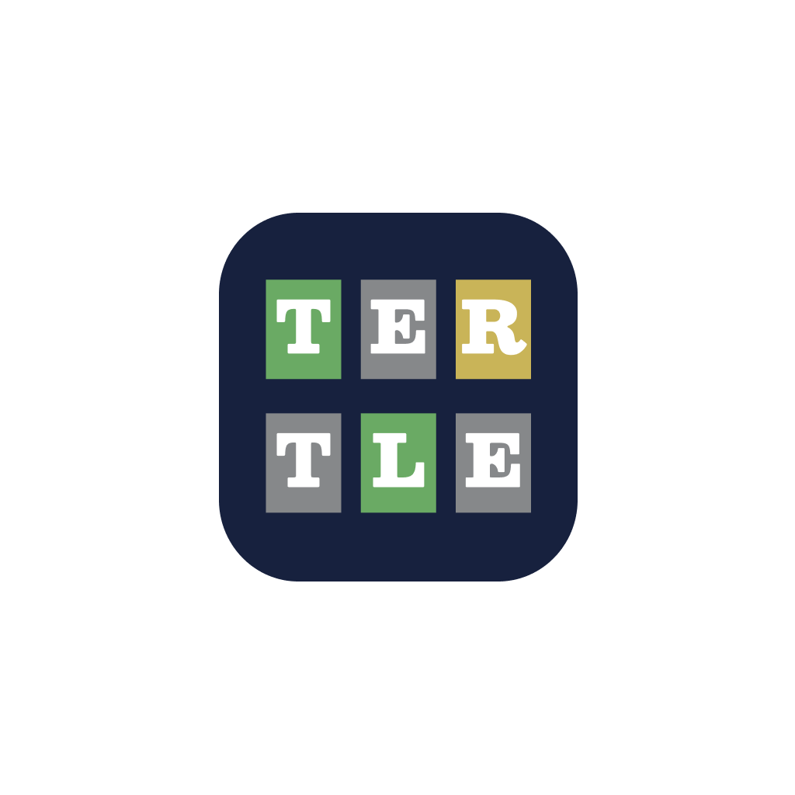

# Tertle

An all-in-one Wordle clone

## https://tertle.netlify.app

With this clone you will never be constrained by one word a day! This clone contains the full Wordle history! When you load the page, by default, it will have the day's current Wordle answer. You can go back and forth in time by using the left and right arrow buttons. The Wordle word and answer list was taken straight from Wordle's source code.

